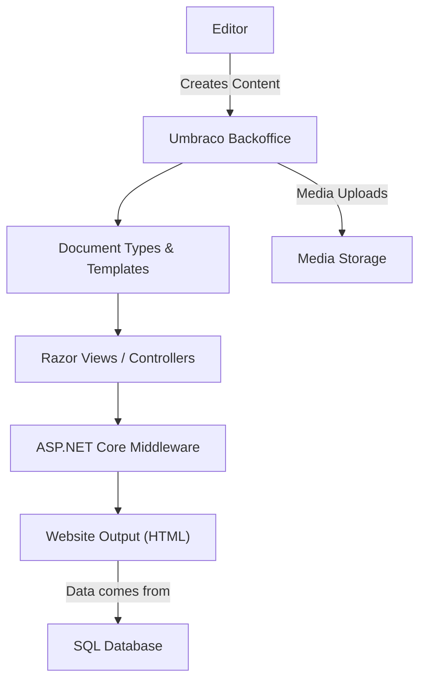
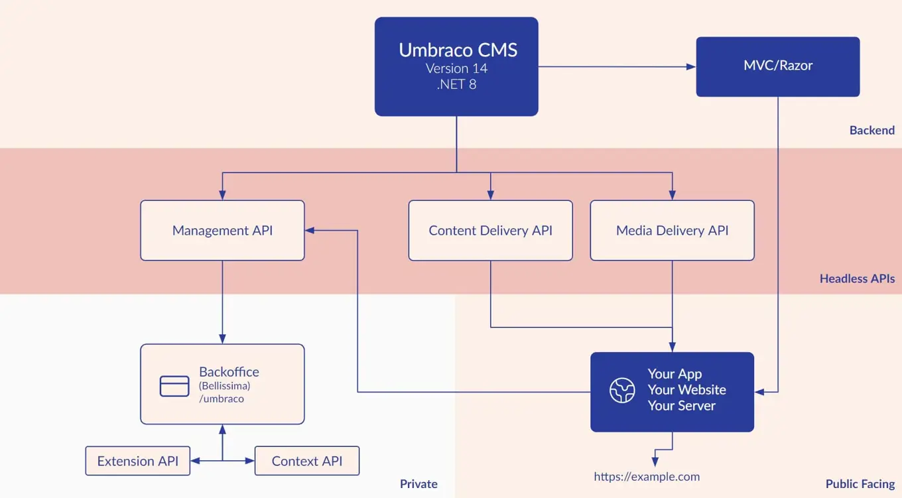

# 🧱 What is Umbraco CMS

> Umbraco CMS is a flexible and editor-friendly Content Management System (CMS) that allows you to create beautiful and modern websites!

---

## 🌐 What is Umbraco CMS?

**Umbraco** is an open-source, .NET-based **Content Management System (CMS)** used to build **websites, apps, and digital experiences**. It's known for being:

- 🔓 **Free and open-source**
- 💻 **Built on modern .NET Core (ASP.NET Core)** (starting v9+)
- 🧠 **Developer-friendly** with Razor, C#, and extensibility
- 🪄 **Editor-friendly** with a smooth backoffice UI
- 🏗️ **Modular and flexible** — suitable for blogs, eCommerce, enterprise portals, and even headless setups

---

## 📜 Official Definition (from [Umbraco.com](https://umbraco.com))

> “Umbraco is the **leading open-source ASP.NET Core CMS**. It provides a flexible and user-friendly platform for building websites, web applications, and digital experiences.”

---

## 🧠 Why Should You Care About Umbraco?

| Feature            | What It Means to You                                     |
| ------------------ | -------------------------------------------------------- |
| 🧩 Modular         | You build reusable Document Types and Templates          |
| ⚙️ Full Control    | You write C# code, Razor views, and can customize deeply |
| 🔐 Secure & Modern | Built on .NET 8 and continuously maintained              |
| 📦 Extensible      | Create your own packages or use open-source ones         |
| 🧠 Headless-ready  | Use REST APIs to power SPA/mobile apps                   |
| 🛠️ Developer First | Git-friendly, Docker-ready, with ModelsBuilder magic     |

---

## 🧱 Real Use Cases

| Project Type         | Why Umbraco Works Well                    |
| -------------------- | ----------------------------------------- |
| 📝 Blogging          | Document Types, easy content flow         |
| 🛒 E-commerce        | Use Vendr / Umbraco Commerce packages     |
| 🏢 Corporate Site    | Granular user roles, clean architecture   |
| 🎯 Marketing Sites   | SEO-friendly templates and media handling |
| 📱 Headless Frontend | Delivery API + React/Vue frontend         |

---

## 🧭 CMS Comparison Table

| Feature             | WordPress      | Umbraco               | Sitecore           |
| ------------------- | -------------- | --------------------- | ------------------ |
| Language            | PHP            | C# / .NET Core        | C# / .NET          |
| Open-source?        | ✅ Yes         | ✅ Yes                | ❌ No (Commercial) |
| Custom Dev-Friendly | 😐 Limited     | 💪 Very strong        | 💪 Strong          |
| Performance         | 🐢 Can be slow | 🚀 Optimized for .NET | ⚡ Fast            |
| Best for...         | Blogs          | Anything on .NET      | Enterprise only    |

---

## 🧠 Core Components at a Glance

<div align="center">



</div>

---

## 📦 Popular Packages in Umbraco

| Package              | Use Case                                  |
| -------------------- | ----------------------------------------- |
| 🧾 **Umbraco Forms** | Build forms without coding                |
| 🛒 **Vendr**         | E-commerce for Umbraco                    |
| 📈 **SEO Checker**   | Helps optimize pages for search engines   |
| 🌍 **uSync**         | Export/import all content types for CI/CD |
| 🔗 **URL Tracker**   | Handle 301 redirects & broken URLs        |

---

## ✅ When to Use Umbraco

- ✅ You’re building in **C#/.NET Core**
- ✅ You want **editor-friendly UI** without sacrificing developer control
- ✅ You need a CMS that’s:

  - Scalable
  - Secure
  - Extendable
  - Git/Docker/CI-friendly

---

## 🧠 When Not to Use It?

- ❌ If your team is only PHP or JavaScript-based
- ❌ You need a super quick blog without any .NET hosting
- ❌ You want a WYSIWYG no-code builder (Umbraco is dev-first!)

---

## 📸 Reference Images

<div style="text-align: center;">
  
</div>

---

## 📦 Install It in 10 Seconds

```bash
dotnet new -i Umbraco.Templates
dotnet new umbraco -n MyProject --friendly-name "My Project" --email admin@example.com --password MyStrongPassword123!
cd MyProject
dotnet run
```

➡️ You’re now running Umbraco at `https://localhost:5001` 🎉

---

## 🧠 Summary

Umbraco is your **.NET-native content management playground**.

It combines:

- ✨ Developer power (C#, Razor, API)
- 🪄 Editor elegance (great UI/UX)
- 🛠️ Real-world extensibility
