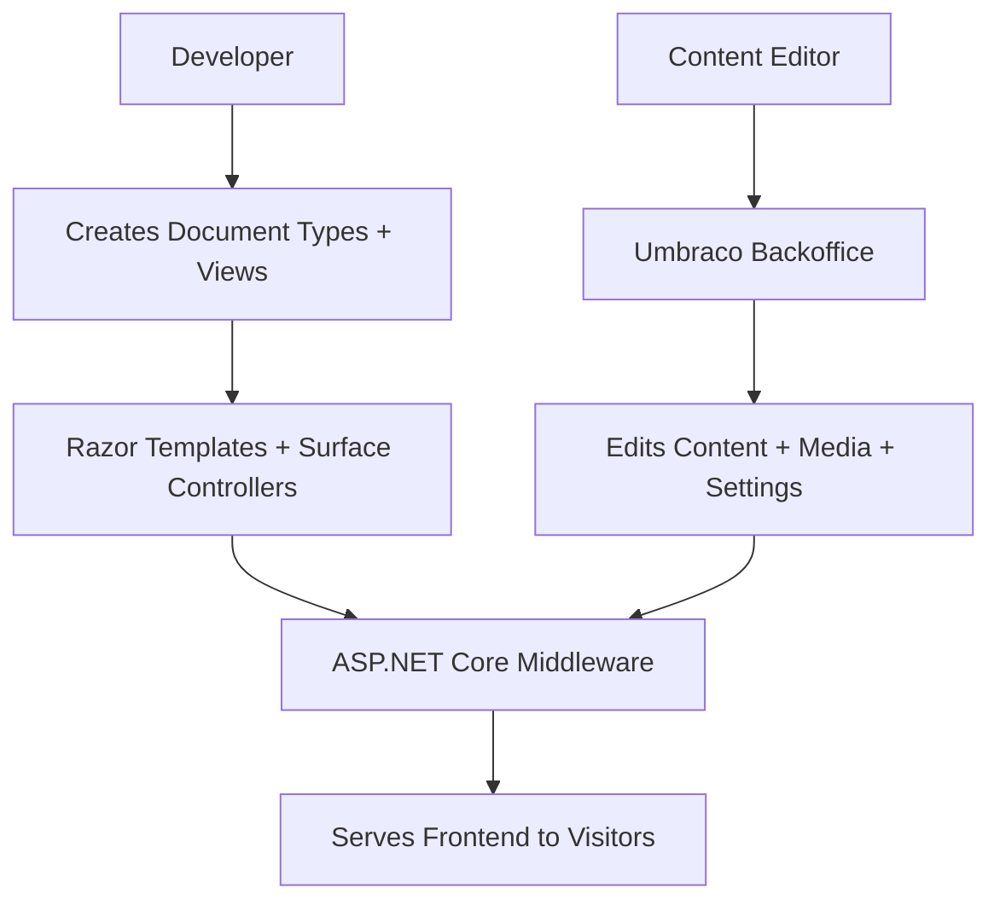
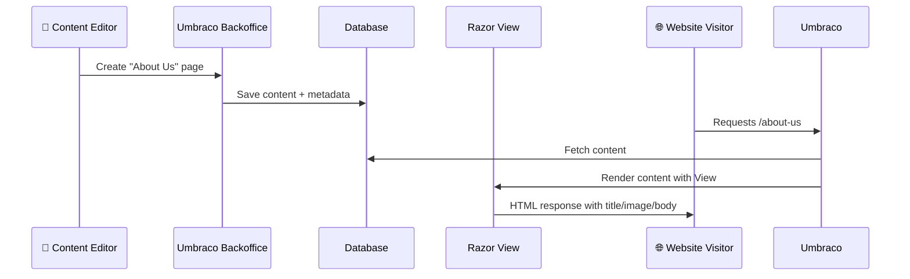

# 🧭 `umbraco_conceptual_overview_for_beginners.md`

> Your beginner-friendly, full-picture map of how Umbraco CMS works, who does what in a project, and how the pieces talk to each other 🧠🔍

---

## 📦 What Is a CMS, Really?

A **Content Management System (CMS)** lets non-developers (called _content editors_) manage website content **without writing code**.

Developers build:

- Structure (document types)
- Layout (templates)
- Code (logic/controllers/views)

Then editors just log into a **backoffice** and edit pages, blog posts, products, etc.

---

## 🧠 Umbraco's Main Components (Conceptual Map)



---

## 🧑‍🤝‍🧑 Project Roles in a Typical Umbraco Project

| Role                      | Responsibilities                                                 |
| ------------------------- | ---------------------------------------------------------------- |
| 👨‍💻 **Backend Developer**  | Build document types, Razor views, controllers, services         |
| 🎨 **Frontend Developer** | Write Razor markup + CSS/JS (Tailwind, Bootstrap)                |
| 🧠 **Umbraco Integrator** | Knows Umbraco APIs, builds forms, handles SEO, backoffice config |
| ✍️ **Content Editor**     | Uses the backoffice to create and edit pages, upload media       |
| 🧑‍🔧 **DevOps**          | Sets up hosting, CI/CD, SQL servers, Docker/Kubernetes           |
| 🧪 **QA/Testers**         | Test the forms, logic, API calls, etc.                           |

> 💬 In small teams (like freelancers), one person may do all roles.

---

## 🧱 How Umbraco Builds a Page (Conceptually)



---

## 🧠 Major Concepts in Umbraco

---

### 1️⃣ **Backoffice** = CMS Dashboard (Admin UI)

This is the **admin panel** that lives at `/umbraco`
Only logged-in **users/editors** can access it.

Sections:

- 🧱 **Content**: Pages, nested structure
- 🖼️ **Media**: Uploaded images/files
- ⚙️ **Settings**: Templates, Document Types
- 👤 **Members**: Public site users (for login)
- 👨‍💻 **Users**: Admins/editors/backoffice people

---

### 2️⃣ **Document Types** = Page Blueprints

They define **what fields** a content page has.

Example:

> A BlogPost Document Type might have:
>
> - Title (TextString)
> - Body (Rich Text)
> - Author (Text)
> - Cover Image (Media Picker)

---

### 3️⃣ **Templates (Views)** = Page HTML Layout

A Razor `.cshtml` file maps to a Document Type.
When someone visits `/about-us`, Umbraco:

- Finds the matching Document Type
- Loads content from DB
- Uses the correct Razor view to render HTML

---

### 4️⃣ **Content Nodes** = Real Pages

Once a Document Type is defined, editors can use it to create new **content nodes** (pages) like:

- /about-us
- /blog/my-first-post

---

### 5️⃣ **Controllers** in Umbraco

Umbraco allows 2 types of custom controllers:

| Type                | Purpose                                                            |
| ------------------- | ------------------------------------------------------------------ |
| `SurfaceController` | Used for **form submissions**, AJAX posts, or redirects from views |
| `ApiController`     | Used to serve **JSON APIs** for frontend (React, Angular, etc.)    |

> These are **optional** — for dynamic or custom logic.

---

### 6️⃣ **ModelsBuilder** = Strong Typing for Content

Umbraco automatically generates C# classes from your Document Types so you can write:

```csharp
@model BlogPost

<h1>@Model.Title</h1>
```

> Like Entity Framework but for your content ✨

---

## 🧰 Developer Workflow (In Order)

```text
1. Define Document Type (e.g., BlogPost)
2. Add Template (Razor View) with same alias (e.g., BlogPost.cshtml)
3. Optionally add a Controller for logic
4. Create content in backoffice
5. Visit /blog/my-first-post → Rendered ✨
```

---

## 💡 Bonus: Where It All Lives

| Layer       | File/Folder                     |
| ----------- | ------------------------------- |
| Razor Views | `/Views/BlogPost.cshtml`        |
| Doc Types   | Stored in database (exportable) |
| Media       | `/Umbraco/Media/`               |
| Templates   | `/Views/` folder                |
| Controllers | `/Controllers/`                 |
| Settings    | `/Umbraco/Config/`              |

---

## ✅ Summary

| Term                   | Meaning                                             |
| ---------------------- | --------------------------------------------------- |
| **CMS**                | Content platform for non-devs to manage web content |
| **Umbraco**            | A CMS built on .NET Core                            |
| **Backoffice**         | The admin UI at `/umbraco`                          |
| **Document Type**      | Blueprint for pages                                 |
| **Template**           | Razor view rendering content                        |
| **Surface Controller** | Form handler                                        |
| **API Controller**     | JSON API                                            |
| **Content Node**       | Actual page created in backoffice                   |

---

## 👇 Want to Practice?

- Create a new Document Type called `Product`
- Add a Razor template for it
- Create 2 products from the backoffice
- Browse to them in your browser
