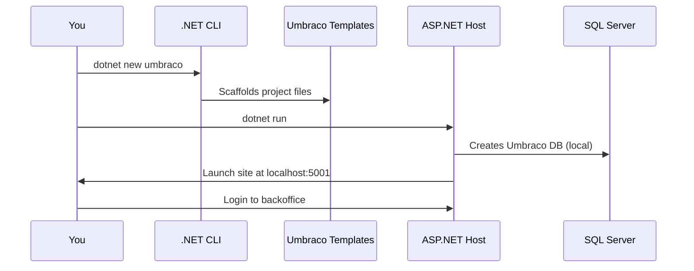

# 🚀 Installing Umbraco V13 Locally

> A smooth ride through installing Umbraco v13 on your machine like a real .NET ninja 🥷💻

---

## 🧾 Official Requirements

Before installing Umbraco v13, make sure you have:

| Tool             | Required Version                         |
| ---------------- | ---------------------------------------- |
| 🧠 .NET SDK      | **.NET 8 SDK** or later                  |
| 🧰 Visual Studio | 2022+ with ASP.NET workload _(optional)_ |
| 🐘 SQL Database  | SQL Server / SQLite / LocalDB            |
| 🐳 Docker        | Optional (for container setup)           |

> 💡 Umbraco v13 is **LTS** (Long-Term Support), built on **.NET 8**. So you need that SDK!

---

## 🧪 Installation Options

You can install Umbraco via:

| Method           | Description                                   |
| ---------------- | --------------------------------------------- |
| ✅ .NET CLI      | Fast, scriptable (best for devs)              |
| 💼 Visual Studio | GUI-based, ideal if you're used to it         |
| 🐳 Docker        | For isolated dev containers or team pipelines |

---

## 🔧 Option 1 – Install via .NET CLI (Recommended)

### ✅ Step 1: Install Umbraco Templates (only once)

```bash
dotnet new -i Umbraco.Templates
```

### ✅ Step 2: Scaffold a new project

```bash
dotnet new umbraco -n MyUmbracoSite \
--friendly-name "Admin" \
--email "admin@example.com" \
--password "Admin123!"
```

📁 This creates a folder `MyUmbracoSite` with all files ready.

---

### ✅ Step 3: Run the site

```bash
cd MyUmbracoSite
dotnet run
```

🌍 Open [https://localhost:5001](https://localhost:5001) in your browser
🧠 Log in with the email/password you provided

---

## 💼 Option 2 – Install via Visual Studio

> If you're more comfy with GUI, this works great too!

1. Open Visual Studio → **Create new project**
2. Select **ASP.NET Core Web App** (empty)
3. Target **.NET 8**
4. Run this in Package Manager Console:

   ```powershell
   dotnet new umbraco
   ```

5. Press F5 and enjoy Umbraco in your browser!

---

## 🐳 Option 3 – Install Umbraco with Docker

> Great for isolated environments and quick resets!

### 🐳 Create `docker-compose.yml`

```yaml
version: "3.4"

services:
  umbraco:
    image: umbraco/umbraco:13
    ports:
      - "8080:80"
    environment:
      - UMBRACO__CMS__GLOBAL__INSTALLUNATTENDED=true
      - UMBRACO__CMS__UNATTENDEDINSTALL__ADMINEMAIL=admin@example.com
      - UMBRACO__CMS__UNATTENDEDINSTALL__ADMINPASSWORD=Admin123!
      - UMBRACO__CMS__UNATTENDEDINSTALL__ADMINUSERNAME=Admin
```

Then run:

```bash
docker compose up
```

> 🎉 Visit `http://localhost:8080`

---

## 🧠 What Happens Behind the Scenes?



---

## 🧪 Troubleshooting Common Errors

| Error                       | Cause                     | Fix                                                             |
| --------------------------- | ------------------------- | --------------------------------------------------------------- |
| `dotnet: command not found` | .NET SDK not installed    | Install [.NET SDK](https://dotnet.microsoft.com/en-us/download) |
| `Login failed`              | Wrong password or user    | Check CLI flags or reset from DB                                |
| Port already in use         | Something else using 5001 | Use `--urls http://localhost:5005`                              |
| Can't connect to DB         | SQL Server not installed  | Use SQLite connection (default)                                 |

---

## 🧠 Tip: Change to SQL Server Instead of SQLite

In `appsettings.json`:

```json
"ConnectionStrings": {
  "umbracoDbDSN": "Server=.;Database=UmbracoDb;Trusted_Connection=True;"
}
```

> Just create a DB in SSMS or Docker and replace it.

---

## ✅ Summary

| Action            | Command                            |
| ----------------- | ---------------------------------- |
| Install templates | `dotnet new -i Umbraco.Templates`  |
| Create project    | `dotnet new umbraco -n MySite ...` |
| Run it            | `dotnet run`                       |
| Docker quickstart | `docker compose up`                |
