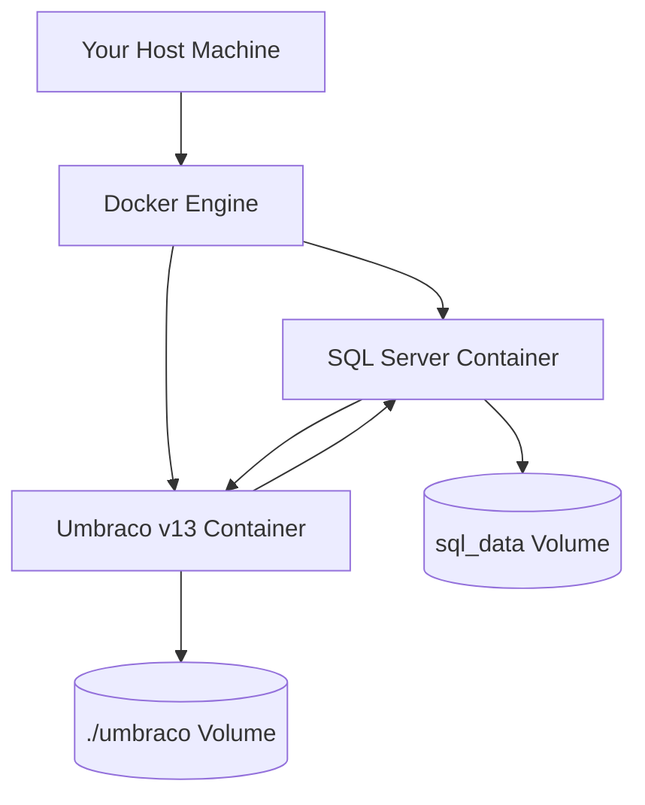

# 🐳 Docker Compose Setup with SQL Server

> Real-world example of running Umbraco v13 in Docker with SQL Server + persistent volumes like a DevOps wizard 🧙‍♂️🐳🗃️

---

## 🎯 Goal

We’ll spin up:

- An **Umbraco v13 container** (ASP.NET Core)
- A **SQL Server container**
- **Volumes** to persist database & media files across restarts

---

## 🧾 Prerequisites

✅ [Docker Desktop](https://www.docker.com/products/docker-desktop/) installed
✅ Your terminal/VS Code ready
✅ Basic understanding of `docker-compose`

---

## 📁 Folder Structure

```ini
umbraco-docker/
├── docker-compose.yml
├── umbraco/          <-- Mounted for media/config persistence
├── data/             <-- SQL Server data volume
```

---

## 🐳 `docker-compose.yml`

```yaml
version: "3.8"

services:
  sqlserver:
    image: mcr.microsoft.com/mssql/server:2022-lts
    container_name: sqlserver
    environment:
      SA_PASSWORD: "P@ssw0rd1234!"
      ACCEPT_EULA: "Y"
    ports:
      - "1433:1433"
    volumes:
      - sql_data:/var/opt/mssql

  umbraco:
    image: umbraco/umbraco:13
    container_name: umbraco
    ports:
      - "8080:80"
    depends_on:
      - sqlserver
    environment:
      UMBRACO__CMS__GLOBAL__INSTALLUNATTENDED: "true"
      UMBRACO__CMS__UNATTENDEDINSTALL__ADMINEMAIL: "admin@example.com"
      UMBRACO__CMS__UNATTENDEDINSTALL__ADMINPASSWORD: "Admin123!"
      UMBRACO__CMS__UNATTENDEDINSTALL__ADMINUSERNAME: "admin"
      UMBRACO__CMS__DATABASES__0__CONNECTIONSTRING: "Server=sqlserver;Database=UmbracoDb;User Id=sa;Password=P@ssw0rd1234!"
      UMBRACO__CMS__DATABASES__0__PROVIDER: "Microsoft.Data.SqlClient"
    volumes:
      - ./umbraco:/app/umbraco

volumes:
  sql_data:
```

---

## 🧠 Explanation of Key Parts

| Section             | What It Does                               |
| ------------------- | ------------------------------------------ |
| `sqlserver` service | Starts SQL Server 2022 with password       |
| `umbraco` service   | Pulls Umbraco v13 official image           |
| `depends_on`        | Waits for SQL Server container to be ready |
| `volumes`           | Persists SQL data + Umbraco media/config   |
| `UNATTENDEDINSTALL` | Skips UI wizard and installs via env vars  |

---

## 🔥 Run It

In your terminal:

```bash
docker compose up -d
```

Check logs:

```bash
docker compose logs -f umbraco
```

---

## 🌍 Access Your Site

Go to: [http://localhost:8080](http://localhost:8080)
Login:

- ✉️ Email: `admin@example.com`
- 🔒 Password: `Admin123!`

🎉 You’re inside the Umbraco backoffice!

---

## 📂 Persistent Volumes

| Volume      | Purpose                                      |
| ----------- | -------------------------------------------- |
| `sql_data`  | Saves your SQL DB across restarts            |
| `./umbraco` | Keeps media files and config changes locally |

You can inspect with:

```bash
docker volume ls
docker volume inspect umbraco-docker_sql_data
```

---

## 🧠 Diagram of Setup



---

## 🧪 Tips & Gotchas

| Problem                     | Solution                                                                    |
| --------------------------- | --------------------------------------------------------------------------- |
| 🐌 Umbraco hangs on startup | SQL container might not be ready. Restart Umbraco or use healthcheck logic. |
| 🧯 SQL login failed         | Make sure SA password matches, and DB is created automatically              |
| ⚠️ Media not persisting     | Ensure `./umbraco` folder exists and is mounted properly                    |
| 🔄 Reset clean              | `docker compose down -v` to reset everything                                |

---

## ✅ Summary

With this setup, you now have:

✅ **Umbraco v13 running in Docker**
✅ **SQL Server with persisted database**
✅ **Media/config saved between restarts**
✅ **No manual install steps – fully automated**
