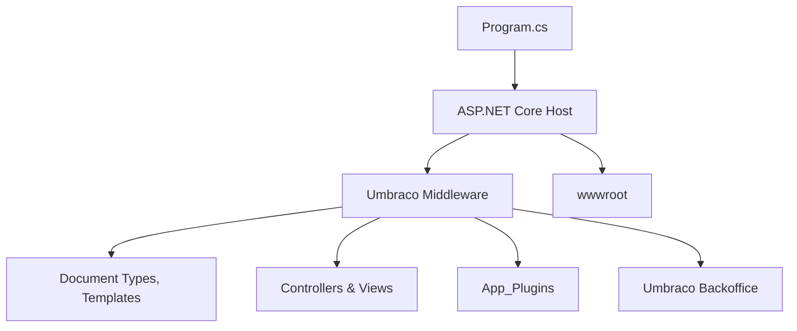
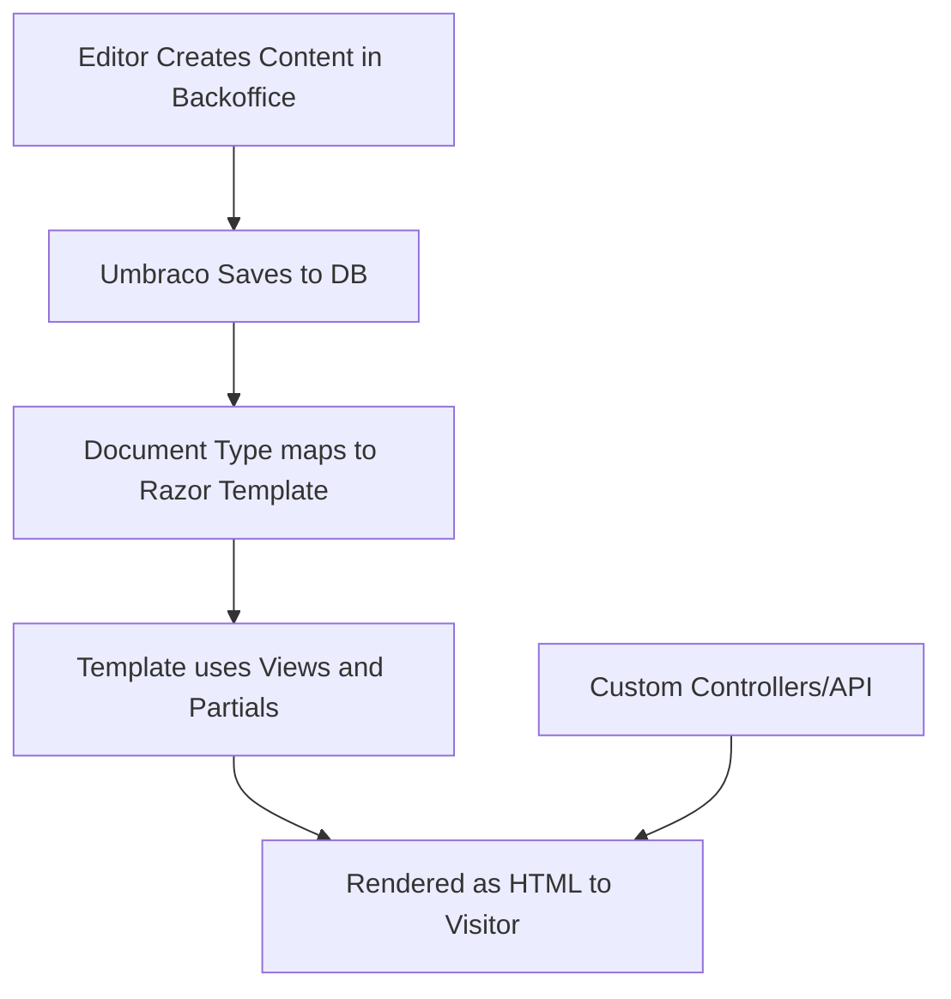

# 🏗️ Umbraco Project Structure and Files

> Understand every file, folder, and config in a real Umbraco v13 project like a pro 🧠📁 — no black boxes allowed!

---

## 📦 Overall Folder Structure (After `dotnet new umbraco`)

```bash
MyUmbracoSite/
├── App_Plugins/
├── Controllers/
├── Models/
├── Views/
├── wwwroot/
├── appsettings.json
├── Program.cs
├── Umbraco/
│   ├── Config/
│   ├── Logs/
│   └── Media/
├── package.json (if frontend tools exist)
```

---

## 🧠 Mermaid: High-Level Structure



---

## 🗂️ Folder-by-Folder Breakdown

---

### 📁 `App_Plugins/`

> Contains **custom backoffice plugins** or property editors

- JS/CSS files used in the Umbraco admin UI
- Use this to create custom fields like Google Maps picker, tag cloud, etc.

```bash
App_Plugins/
└── MyColorPicker/
    ├── package.manifest
    ├── colorpicker.controller.js
    └── colorpicker.view.html
```

---

### 📁 `Controllers/`

> Your custom **SurfaceControllers** and **API controllers**

- SurfaceControllers = handle form submissions (HTML/Razor)
- API Controllers = serve JSON (for Angular/React frontend or integrations)

Example:

```csharp
public class ContactSurfaceController : SurfaceController {
  public IActionResult SubmitForm(ContactModel model) { ... }
}
```

---

### 📁 `Models/`

> If you use **ModelsBuilder (SourceCode)**, it generates your strongly typed content models here.

```csharp
public partial class BlogPost : PublishedContentModel {
  public string Title => this.Value<string>("title");
}
```

📌 Only generated if `ModelsBuilder` is set to use SourceCode mode.

---

### 📁 `Views/`

> Your **Razor templates** for pages, partials, and layouts

```bash
Views/
├── Layout.cshtml          # Site-wide layout
├── Home.cshtml            # Template for Home Document Type
├── BlogPost.cshtml        # Template for BlogPost
└── Partials/
    └── Header.cshtml
```

> These templates are matched with **Document Types** by alias in the backoffice.

---

### 📁 `wwwroot/`

> Static web assets (CSS, JS, images)

```bash
wwwroot/
├── css/
├── js/
└── favicon.ico
```

💡 Use this to add client-side logic, Bootstrap/Tailwind, etc.

---

### 📁 `Umbraco/`

> Umbraco’s internal folders (auto-managed)

```bash
Umbraco/
├── Config/     # Site-specific configs
├── Logs/       # All Umbraco logs here (use Serilog)
└── Media/      # Uploaded media (via backoffice)
```

You don’t create these – Umbraco generates them.

---

## ⚙️ Config & Startup Files

---

### 📄 `Program.cs`

> Startup point for the ASP.NET Core app

```csharp
var builder = WebApplication.CreateBuilder(args);
builder.Services.AddUmbraco(...).AddBackOffice().AddWebsite().Build().Run();
```

📌 You can add middlewares, DI services, configure routing, etc.

---

### 📄 `appsettings.json`

> Main config file for connection strings, logging, custom settings

```json
{
  "ConnectionStrings": {
    "umbracoDbDSN": "Server=...;Database=...;"
  },
  "Umbraco": {
    "CMS": {
      "Global": {
        "Id": "MyUmbracoSite"
      },
      "UnattendedInstall": {
        "AdminEmail": "...",
        "AdminPassword": "..."
      }
    }
  }
}
```

---

### 📄 `.csproj` (Project File)

> NuGet packages, target framework, Razor options, ModelsBuilder setup

Example:

```xml
<Project Sdk="Microsoft.NET.Sdk.Web">
  <PropertyGroup>
    <TargetFramework>net8.0</TargetFramework>
    <UserSecretsId>MySite-Secrets</UserSecretsId>
  </PropertyGroup>

  <ItemGroup>
    <PackageReference Include="Umbraco.Cms" Version="13.*" />
  </ItemGroup>
</Project>
```

---

## 🧠 Workflow Summary

<div align="center">



</div>

---

## 🔥 Pro Tips

- ✅ Organize custom logic into `Services/`, `Helpers/`, or `Repositories/` (even though not scaffolded by default)
- ✅ Use **ViewComponents** for reusable page blocks
- ✅ Use **ModelsBuilder.SourceCode** mode in dev; switch to `PureLive` in production if you need hot reload

---

## 🧪 Quick Practice Ideas

- 🔧 Create a custom Razor layout with Bootstrap
- 🎨 Add an image upload field in Document Type and display in view
- 🛠️ Add a SurfaceController for a contact form
- 🧰 Explore the `App_Plugins` folder by installing a package (e.g. SEO Checker)

---

## ✅ Summary

| Folder             | Role                                     |
| ------------------ | ---------------------------------------- |
| `App_Plugins/`     | Backoffice plugins (JS/CSS for editors)  |
| `Controllers/`     | MVC logic for forms or APIs              |
| `Models/`          | Strongly typed content models            |
| `Views/`           | Razor templates mapped to Document Types |
| `wwwroot/`         | Static frontend files (CSS, JS)          |
| `Umbraco/`         | Internal configs, logs, media            |
| `Program.cs`       | Startup config                           |
| `appsettings.json` | DB, CMS config, etc.                     |
