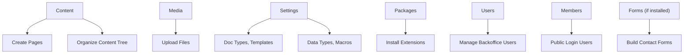

# 🧰 Umbraco backoffice ui explained

> A smart, funny, and clear walkthrough of the **Umbraco Backoffice UI**, what every section means, and what devs vs. editors should actually _touch_ 😄🧑‍💻

---

## 🔐 What is the Backoffice?

**The Backoffice** is the secure admin panel of your Umbraco site — it lives at:

```ini
https://localhost:5001/umbraco
```

Think of it as:

- The **CMS Dashboard**
- The **mission control** for content, templates, media, users, and settings

Only **logged-in users** (editors, devs, admins) can access it.

---

## 🎯 What Happens Here?

| Role              | What They Do in the Backoffice    |
| ----------------- | --------------------------------- |
| 👩‍🎨 Content Editor | Creates pages, uploads images     |
| 👨‍💻 Developer      | Defines Document Types, templates |
| 🧪 Tester         | Checks drafts, preview features   |
| 👨‍🔧 Admin          | Manages users/permissions         |

---

## 🧭 Backoffice Main Sections (Default Sidebar)



---

## 🧱 1. 📄 **Content Section** = Pages (Like a Tree)

This is where **pages live**, created by editors using the blueprints you (the dev) define.

- 🌳 Tree structure → like folders and subfolders
- 📝 Each node = 1 page (e.g. `/about`, `/blog/my-post`)
- 🔗 Pages use Templates + Document Types

📌 Pages here are **rendered in the frontend**!

---

## 🖼️ 2. 🖼 **Media Section** = File Storage

Drag and drop your:

- Images
- PDFs
- Videos
- Logos

Umbraco auto-saves them in `/umbraco/Media/`
Accessible via Media Picker fields or `@Model.GetCropUrl("image")`

📦 Supports folders and image crops!

---

## ⚙️ 3. ⚙️ **Settings Section** = Where Developers Live

This is where you, the developer, build your CMS building blocks:

| Item              | What It Does                                            |
| ----------------- | ------------------------------------------------------- |
| 📐 Document Types | Define structure of content (fields like Title, Image)  |
| 🧬 Data Types     | Reusable field types (RichText, Media Picker, Dropdown) |
| 💻 Templates      | Razor views (linked to Doc Types)                       |
| 📦 Macros         | Reusable Razor partials                                 |
| 💠 Partial Views  | HTML snippets (header, nav, etc.)                       |
| 📑 Content Apps   | Extend page editing interface                           |

🛑 This section should not be touched by content editors.

---

## 📦 4. 📦 **Packages Section**

Install plugins like:

- SEO Checker
- Umbraco Forms
- uSync
- Vendr (eCommerce)

You can also **create your own** packages for reuse between projects.

---

## 👥 5. 👨‍💻 **Users Section**

Manages **backoffice users**:

- Admins
- Content editors
- Developers

You can assign granular **permissions per section/page**, like:

- Read-only access to `/blog`
- Full access to Media only

---

## 👤 6. 👥 **Members Section**

Different from Users!

These are **site-facing users**, e.g.:

- Logged-in customers
- Newsletter subscribers
- Forum users

Used for:

- Member-only areas
- Login/logout forms
- Protected pages

---

## ✍️ 7. 🧾 **Forms Section** _(optional)_

If you install **Umbraco Forms**, you get:

- Drag & drop form builder
- Email notifications
- Submissions dashboard

Ideal for:

- Contact us
- Booking
- Feedback

---

## 🧠 Content Node Editor UI (When Editing a Page)

When you click a page node in “Content,” you get:

| Tab                 | What It Contains                   |
| ------------------- | ---------------------------------- |
| 🧾 **Content**      | All the fields (from the Doc Type) |
| ⚙️ **Info**         | URL, Template, Culture             |
| 🗂️ **Properties**   | Create date, ID, etc.              |
| 👁 **Preview**       | Live preview of the page           |
| 🚀 **Save/Publish** | Control publishing manually        |

---

## 🧠 Developer vs Editor Access Summary

| Section      | Developer      | Editor   |
| ------------ | -------------- | -------- |
| **Settings** | ✅ Yes         | ❌ No    |
| **Content**  | ✅ Yes         | ✅ Yes   |
| **Media**    | ✅ Yes         | ✅ Yes   |
| **Users**    | ✅ Admins only | ❌ No    |
| **Members**  | ✅ Optional    | Optional |
| **Packages** | ✅ Yes         | ❌ No    |

---

## 🔐 Security Tips

- Always **restrict editor permissions** to what they need
- Enable **preview-only access** for content reviewers
- Avoid giving non-devs access to “Settings” or “Templates”

---

## ✅ Summary

| Area     | What Happens                            |
| -------- | --------------------------------------- |
| Content  | Create and manage real pages            |
| Media    | Upload + organize files                 |
| Settings | Define structure (Doc Types, Views)     |
| Users    | Backoffice people                       |
| Members  | Public site login users                 |
| Packages | Add/remove features                     |
| Forms    | Build forms with no code (if installed) |

---

## 🔧 Want a Practice Challenge?

- ✅ Define a `Product` Document Type in **Settings**
- ✅ Add `Name`, `Price`, `Image` fields
- ✅ Create a `Product.cshtml` template
- ✅ Create a page under “Content” → `All Products`
- ✅ Add 3 sample product nodes
