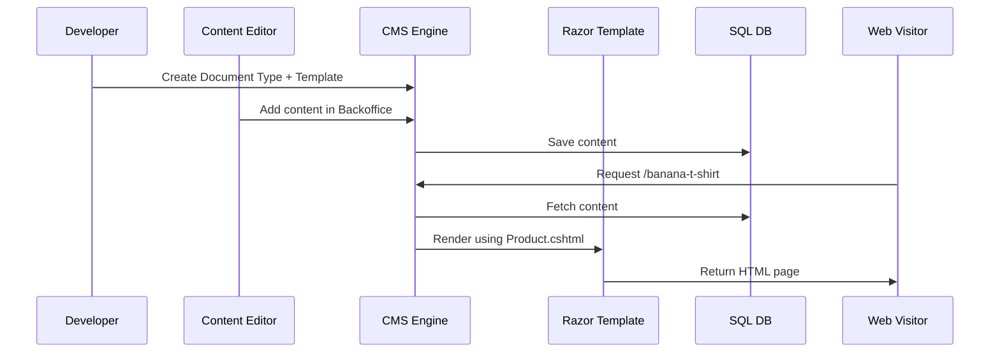

# 🧱 Creating Document type template content

> Build your first content page the Umbraco way: define structure (Document Type), layout (Template), and actual content 🔧📝🌍

---

## 🧠 What's a Document Type?

A **Document Type** is like a **blueprint for a page**.

It defines:

- What fields that page has (e.g. Title, Body, Image)
- How it behaves (can it be nested? does it have children?)
- Which template renders it

📦 Umbraco stores this in the **database**, not as files.

---

## 🧠 What's a Template?

A **Template** is a `.cshtml` Razor file that defines the **HTML structure** of your page.

Umbraco uses the Template associated with the Document Type to render the content at runtime.

---

## 🔨 What We’ll Build

🛍️ A `Product` page that has:

- Name (`TextString`)
- Price (`Decimal`)
- Description (`RichText`)
- Image (`Media Picker`)

And we’ll:

- Create the `Product` Document Type in the backoffice
- Add a Razor Template: `Product.cshtml`
- Create a sample product in Content
- Display it in the browser

---

## ✍️ Step 1: Create the Document Type

> In the **Settings** section of the backoffice:

1. Go to **Settings → Document Types → Create New Document Type**
2. Name it: `Product`
3. ✅ Enable "Is an Element Type" → ❌ (we want this to be a page, not a nested component)
4. ✅ Check "Create template" (Umbraco will generate `Product.cshtml`)

---

### ➕ Add Fields

Under **Product → Generic Properties**:

| Field Name  | Type             | Alias         |
| ----------- | ---------------- | ------------- |
| Name        | TextString       | `productName` |
| Price       | Decimal          | `price`       |
| Description | Rich Text Editor | `description` |
| Image       | Media Picker     | `image`       |

💡 You can drag to reorder these.

---

## 💡 Document Type Tabs

You can also group fields under **Tabs** like:

- Main
- SEO
- Technical Specs

For now, stick to one default tab.

---

## 💻 Step 2: Edit the Template (`Product.cshtml`)

Umbraco created the file at:

```ini
/Views/Product.cshtml
```

Open it and update:

```cshtml
@inherits Umbraco.Cms.Web.Common.Views.UmbracoViewPage<ContentModels.Product>
@using ContentModels = Umbraco.Cms.Web.Common.PublishedModels;

@{
    Layout = "Layout.cshtml";
}

<h1>@Model.ProductName</h1>

<p><strong>Price:</strong> $@Model.Price</p>

<article>@Model.Description</article>

@if (Model.Image != null)
{
    
}
```

✔️ This uses **strongly-typed ModelsBuilder classes**!

---

## 🌱 Step 3: Add the Page in "Content"

> In the **Content** section:

1. Right-click the root node → “Create”
2. Choose **Product**
3. Name it: “Banana T-Shirt”
4. Fill in fields:

   - Name: Banana T-Shirt
   - Price: 19.99
   - Description: "Super soft 🍌 cotton tee."
   - Image: Upload an image

✅ Click **Save & Publish**

---

## 🌐 Step 4: Browse the Page

- Visit your site: `https://localhost:5001/banana-t-shirt`
  (Or whatever the slug was)

💥 You just created your first dynamic page using Umbraco’s CMS model!

---

## 🧠 How It All Connects



---

## 🛠️ Bonus: Use the Template in Layout

If you have a layout file (`Layout.cshtml`), wrap your content block:

```cshtml
<main class="container">
    <h1>@Model.ProductName</h1>
    ...
</main>
```

---

## ✅ Summary

| Piece         | Role                                    |
| ------------- | --------------------------------------- |
| Document Type | Defines content structure               |
| Template      | Renders the content as HTML             |
| Content Node  | Actual page made from DocType           |
| Razor View    | Uses `@Model.Property` to render fields |

---

## 👇 Practice Challenge

1. Create a `BlogPost` Document Type with:

   - Title (Text)
   - Body (RichText)
   - Author (Text)
   - Featured Image (Media Picker)

2. Create its template
3. Publish a blog post
4. Preview it!
