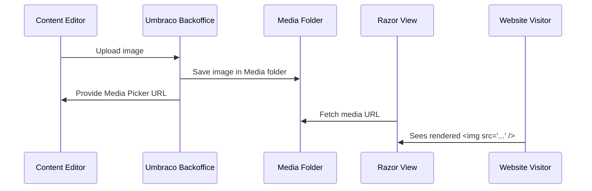

# 🖼️ Working With Media In Umbraco

> Learn how to upload, manage, organize, and render images and files in Umbraco v13 like a true CMS artist 🎨🧑‍🎨

---

## 📂 What is the Media Section?

The **Media Section** in the Umbraco Backoffice is a built-in file manager for:

- Images (JPG, PNG, SVG)
- PDFs / Docs
- Audio, Video
- Logos, icons, etc.

### 📍 Path

Accessible at:

```ini
/umbraco/#/media
```

These files are stored on disk in:

```ini
/Umbraco/Media/
```

Each upload creates a **GUID-based folder** like:

```ini
/Umbraco/Media/5d1a6c43444445688a2391c799323bf0/my-pic.jpg
```

---

## 🎯 Real-World Use Cases

| Use Case             | How Media Helps You                   |
| -------------------- | ------------------------------------- |
| 🖼️ Page Banner Image | Upload and pick via Media Picker      |
| 📥 PDF Downloads     | Upload and link to on frontend        |
| 💡 SEO Thumbnails    | Custom OG/social images               |
| 🎯 Marketing Assets  | Manage all brand content in one place |

---

## 🧪 Media Types vs Data Types

- **Data Type** = Media Picker field you add to a Document Type
- **Media Type** = Template for _how_ media behaves (custom fields)

> Example: You can extend the Image Media Type to include:
>
> - 📸 Photographer Name
> - 🏷️ Alt text
> - 📆 Copyright Year

---

## 🛠️ Step-by-Step: Uploading and Using Media

---

### ✅ Step 1: Upload a File

1. Go to **Media** section
2. Right-click “Media” → “Create Folder” → `Product Images`
3. Inside it → Click ➕ → “Image”
4. Upload your image: `banana-tshirt.jpg`

You’ll see:

- A preview
- File name
- URL
- File size

---

### ✅ Step 2: Use a Media Picker in Document Type

1. Go to **Settings → Document Types → Product**
2. Add a **Media Picker** field → Name: `Image`
3. Save & Update Template

In `Product.cshtml`:

```cshtml
@if (Model.Image != null)
{
    
}
```

---

## 📸 Responsive Image Rendering with Crops

Umbraco has built-in support for:

- Image cropping
- Automatic resizing
- Focal point setting

---

### ✂️ Define Crops (Optional)

1. Go to **Settings → Data Types → Image Cropper**
2. Create `ProductImageCrop` with sizes:

   - `Thumbnail`: 300x300
   - `Banner`: 1200x400

Apply the cropper as your Media Picker’s Data Type.

---

### 🧠 Use Cropped Images in Razor

```cshtml
@Model.Image.GetCropUrl("Thumbnail")
```

Or fallback:

```cshtml

```

---

## 🧠 Tip: Display Media Properties

You can access metadata from media fields:

```cshtml
@Model.Image.Name
@Model.Image.Url()
@Model.Image.CreateDate
```

---

## 📁 Where Is Media Stored?

| Env    | Location                             |
| ------ | ------------------------------------ |
| Dev    | `/Umbraco/Media/{guid}/filename`     |
| Prod   | Can be Azure Blob or S3 (via config) |
| Backup | Include `/Umbraco/Media` in backup   |

---

## 🔐 Media Security

By default, media files are **publicly accessible** by URL.
You can secure PDFs and other files via:

- Member-only pages with **protected folders**
- Custom logic + virtual paths

---

## 📦 Bonus: Add Alt Text Field to Media Types

1. Go to **Settings → Media Types → Image**
2. Add a new field: `Alt Text` (TextString)
3. In Razor:

```cshtml

```

Now editors can improve SEO and accessibility 💪

---

## 🧠 Behind the Scenes (Media Flow)



---

## ✅ Summary

| Feature               | Description                          |
| --------------------- | ------------------------------------ |
| 🖼️ Media Section      | Stores & organizes images/files      |
| 📌 Media Picker Field | Allows linking media to content      |
| ✂️ Crops              | Enables responsive image sizes       |
| 🧠 Metadata           | Add alt text, credits, etc.          |
| 🔐 Security           | By default: public URLs (can secure) |

---

## 🚀 Practice Challenge

- Add a **Media Picker** to your `BlogPost` Document Type → call it `FeaturedImage`
- Add a cropper for `"WideBanner"` = 1200x400
- Display it in Razor with:

```cshtml

```
