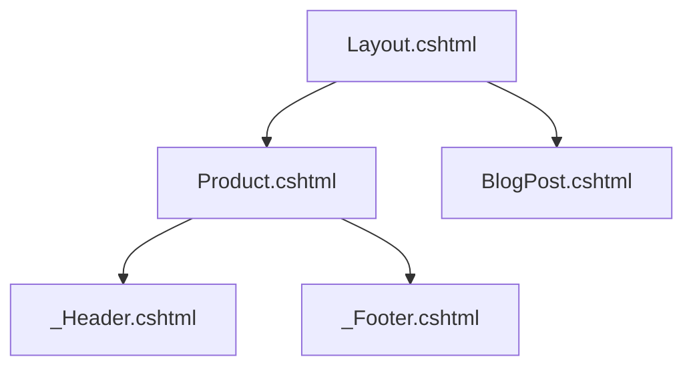

# 🧱 Views layouts and partial views

> Learn how to use **Layouts**, **Views**, and **Partial Views** in Umbraco to build structured, DRY, and maintainable Razor pages 🧼📄🧠

---

## 🧠 What Are They?

| Concept          | Meaning                                                       |
| ---------------- | ------------------------------------------------------------- |
| **Layout**       | The base HTML shell for all pages (header/footer, etc.)       |
| **View**         | The template tied to a Document Type (e.g. Product.cshtml)    |
| **Partial View** | A reusable Razor snippet for sections like nav, footer, cards |

---

## 🧬 How They Work Together



You define the outer structure in `Layout.cshtml`, and inside individual views (e.g., `Product.cshtml`) you render specific content.
**Partials** are reusable “widgets” within either the Layout or individual views.

---

## 📂 Folder Structure

```bash
/Views/
├── Layout.cshtml         ← Shared layout
├── Home.cshtml           ← View for Home page
├── Product.cshtml        ← View for Product Document Type
└── Partials/
    ├── _Header.cshtml    ← Shared header partial
    ├── _Footer.cshtml    ← Shared footer partial
    └── _ProductCard.cshtml ← Reusable product box
```

---

## 🧱 Step-by-Step

---

### ✅ Step 1: Create a Layout

In `/Views/Layout.cshtml`:

```cshtml
<!DOCTYPE html>
<html>
<head>
    <title>@Umbraco.AssignedContentItem.Name</title>
    <meta charset="utf-8" />
    <link rel="stylesheet" href="/css/site.css" />
</head>
<body>
    @Html.Partial("Partials/_Header")

    <main class="container">
        @RenderBody()
    </main>

    @Html.Partial("Partials/_Footer")
</body>
</html>
```

🧠 `@RenderBody()` is where Razor will inject the page-specific content.

---

### ✅ Step 2: Assign the Layout to Your Views

At the top of each view (e.g. `Product.cshtml`):

```cshtml
@inherits Umbraco.Cms.Web.Common.Views.UmbracoViewPage<ContentModels.Product>
@using ContentModels = Umbraco.Cms.Web.Common.PublishedModels;

@{
    Layout = "Layout.cshtml";
}
```

---

### ✅ Step 3: Create Partial Views

> Go to **Settings → Partial Views → Create Partial View → Empty**

Name: `_Header.cshtml`

```cshtml
<header>
  <nav>
    <a href="/">Home</a> |
    <a href="/products">Products</a> |
    <a href="/blog">Blog</a>
  </nav>
</header>
```

---

### ✅ Step 4: Use Partial in Layout or Template

In `Layout.cshtml`:

```cshtml
@Html.Partial("Partials/_Header")
```

OR in a specific template:

```cshtml
@Html.Partial("Partials/_ProductCard", Model)
```

---

## 🧠 Partial with Model (Typed Rendering)

Let’s say you create `_ProductCard.cshtml` for product listings.

```cshtml
@model ContentModels.Product

<div class="product-card">
    
    <h3>@Model.ProductName</h3>
    <p>$@Model.Price</p>
    <a href="@Model.Url()">View</a>
</div>
```

Then in a list view like `Products.cshtml`:

```cshtml
@foreach (var item in Model.Children())
{
    @Html.Partial("Partials/_ProductCard", item)
}
```

🎯 This pattern is excellent for listing things like:

- Blog posts
- Products
- Team members

---

## 🔍 Render vs Partial vs ViewComponent?

| Razor Method                     | Use Case                       |
| -------------------------------- | ------------------------------ |
| `@RenderBody()`                  | Used only in Layout            |
| `@Html.Partial()`                | Synchronous, simple blocks     |
| `@await Html.PartialAsync()`     | Async partials                 |
| `@await Component.InvokeAsync()` | Full ViewComponents (advanced) |

---

## 📁 Views Path Rules

| View Type    | Folder                                      |
| ------------ | ------------------------------------------- |
| Templates    | `/Views/`                                   |
| Layout       | `/Views/Layout.cshtml`                      |
| Partials     | `/Views/Partials/`                          |
| Shared Views | You can organize under `/Views/Shared/` too |

Umbraco uses **Document Type alias** to match a view file.
E.g. a `BlogPost` DocType → `Views/BlogPost.cshtml`

---

## 🧠 Gotchas to Avoid

| Mistake                          | Fix                                           |
| -------------------------------- | --------------------------------------------- |
| Not setting Layout in Razor      | Use `@{ Layout = "Layout.cshtml"; }`          |
| Wrong partial path               | Use `"Partials/_MyPartial"` not `"Views/..."` |
| Forgetting to inherit model      | Always use `@inherits ...UmbracoViewPage<>`   |
| Case sensitivity in Linux/Docker | Stick to lowercase filenames                  |

---

## ✅ Summary

| Concept      | Purpose                          |
| ------------ | -------------------------------- |
| Layout       | Base page structure (HTML shell) |
| View         | Template per page (from DocType) |
| Partial View | Reusable Razor snippets          |
| RenderBody() | Injects the content of a view    |

---

## 🚀 Practice Challenge

- Create a layout file with:

  - `@RenderBody()`
  - Partial header and footer

- Add a new partial `_BlogCard.cshtml`
- Display blog posts in a list using that partial
