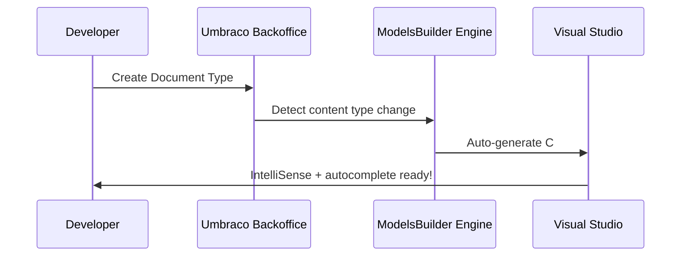

# 🧠 `modelsbuilder_explained.md`

> Understand how **Umbraco ModelsBuilder** works, how to generate strongly typed models from your Document Types, and when to use each mode 💪📦

---

## 💡 What is ModelsBuilder?

**ModelsBuilder** is Umbraco’s built-in tool that auto-generates **C# classes** from your **Document Types** so you can write:

```csharp
@Model.Title
```

instead of:

```csharp
@Model.Value<string>("title")
```

> 🔥 Strong typing, IntelliSense, compiler checks, less typos = more productivity

---

## 🧠 Why Use It?

| Benefit          | What It Means                               |
| ---------------- | ------------------------------------------- |
| 🧠 Strong Typing | Auto-complete in Razor, compile-time errors |
| ⚡ Fast Dev      | No more guessing aliases or casting         |
| 🔒 Safer         | Avoid typos like `"blogtite"`               |
| 🧼 Cleaner       | No `Model.Value<string>("prop")` soup       |

---

## 🧬 How It Works

When you define a Document Type (e.g. `Product`) with fields:

- `productName` (TextString)
- `price` (Decimal)
- `description` (RichText)

ModelsBuilder generates:

```csharp
public partial class Product : PublishedContentModel {
    public string ProductName => this.Value<string>("productName");
    public decimal Price => this.Value<decimal>("price");
}
```

So in `Product.cshtml`:

```csharp
@model Umbraco.Cms.Web.Common.PublishedModels.Product
<h1>@Model.ProductName</h1>
```

Boom. Clean. Fast. Bulletproof.

---

## 📦 ModelsBuilder Modes (Pick One)

| Mode              | Description                                               |
| ----------------- | --------------------------------------------------------- |
| 🔁 **PureLive**   | Auto-generates models in memory (default for fast builds) |
| 🧾 **SourceCode** | Saves `.cs` files to disk you can inspect and edit        |
| 📦 **Dll**        | Precompiled in a DLL — fastest runtime, least editable    |

---

### ✅ Recommended Mode (for Devs)

> Use **SourceCode** mode in dev
> Use **Dll or PureLive** in production

---

## 🛠️ Enable SourceCode Mode (Optional)

In `appsettings.json`:

```json
"Umbraco": {
  "CMS": {
    "ModelsBuilder": {
      "ModelsMode": "SourceCode"
    }
  }
}
```

📂 Models will now appear in:

```ini
/umbraco/models/
```

You can move this to `/Models/` using config:

```json
"Umbraco": {
  "CMS": {
    "ModelsBuilder": {
      "ModelsDirectory": "~/Models/"
    }
  }
}
```

---

## 🧠 Behind the Scenes (Generation Flow)



---

## 🔧 Use Models in Razor Views

1. Add alias to template (e.g. `Product.cshtml`)
2. Add model declaration at top:

   ```csharp
   @inherits Umbraco.Cms.Web.Common.Views.UmbracoViewPage<ContentModels.Product>
   @using ContentModels = Umbraco.Cms.Web.Common.PublishedModels;
   ```

3. Use properties:

   ```cshtml
   <h1>@Model.ProductName</h1>
   <p>Price: $@Model.Price</p>
   ```

---

## 🧪 Can’t See Your Model?

🧯 Try rebuilding the project:

```bash
dotnet clean && dotnet build
```

Or in VS: `Build → Rebuild Solution`

Also check:

- `appsettings.json` has correct mode
- Field alias matches your property (case-sensitive)

---

## ✅ Summary

| Feature       | ModelsBuilder                                 |
| ------------- | --------------------------------------------- |
| Purpose       | Generate strongly-typed models from Doc Types |
| Dev Benefit   | Autocomplete, safety, speed                   |
| Modes         | PureLive, SourceCode, Dll                     |
| Best Dev Mode | SourceCode                                    |
| Razor Usage   | `@Model.PropertyName`                         |

---

## 🧪 Practice Challenge

- Create a `TeamMember` Doc Type with:

  - Name (Text)
  - Job Title (Text)
  - Photo (Media Picker)

- Generate model
- Use it in a Razor template with:

  ```cshtml
  <h2>@Model.Name</h2>
  <p>@Model.JobTitle</p>
  
  ```
