# 🧾 `creating_forms_in_umbraco.md`

> Learn how to create real working forms in Umbraco v13 — from Razor + SurfaceController to using Umbraco Forms for drag-and-drop solutions 🧠📤

---

## 🎯 What Are the Options?

| Method                            | Use Case                                       |
| --------------------------------- | ---------------------------------------------- |
| ✅ Razor Form + SurfaceController | Full control via code (best for devs)          |
| 🧰 Umbraco Forms Package          | Drag & drop UI form builder (best for editors) |

We’ll build both 💪

---

## 1️⃣ ✅ Razor + SurfaceController (Developer Way)

---

### 🧱 Step 1: Create the ViewModel

📁 File: `Models/ContactFormModel.cs`

```csharp
public class ContactFormModel
{
    public string Name { get; set; }
    public string Email { get; set; }
    public string Message { get; set; }
}
```

---

### 🧱 Step 2: Create the SurfaceController

📁 File: `Controllers/ContactSurfaceController.cs`

```csharp
using Microsoft.AspNetCore.Mvc;
using Umbraco.Cms.Web.Common.Controllers;
using YourNamespace.Models;

public class ContactSurfaceController : SurfaceController
{
    public ContactSurfaceController(...) : base(...) { }

    [HttpPost]
    [ValidateAntiForgeryToken]
    public IActionResult Submit(ContactFormModel model)
    {
        if (!ModelState.IsValid)
        {
            return CurrentUmbracoPage();
        }

        // TODO: Save to DB or send email
        TempData["Success"] = "Thanks for contacting us!";
        return RedirectToCurrentUmbracoPage();
    }
}
```

🧠 `RedirectToCurrentUmbracoPage()` reloads the page with a clean URL

---

### 📄 Step 3: Add the Razor Form

In `Views/Contact.cshtml` (or any template):

```cshtml
@model YourNamespace.Models.ContactFormModel

@if (TempData["Success"] != null)
{
    <p class="success">@TempData["Success"]</p>
}

@using (Html.BeginUmbracoForm("Submit", "ContactSurface"))
{
    @Html.AntiForgeryToken()

    <label>Name</label>
    <input type="text" name="Name" required />

    <label>Email</label>
    <input type="email" name="Email" required />

    <label>Message</label>
    <textarea name="Message"></textarea>

    <button type="submit">Send</button>
}
```

💡 This is a traditional HTML form that posts to your SurfaceController.

---

## 🧠 How It Works (Behind the Scenes)

```mermaid
sequenceDiagram
  participant User as 🌍 Website Visitor
  participant View as Razor Form
  participant Controller as SurfaceController
  participant Umbraco as CMS Engine

  User->>View: Fill and submit form
  View->>Controller: POST data to Submit()
  Controller->>Umbraco: Save data or send email
  Controller->>User: Redirect with success message
```



---

## 🧪 Optional: Add Data Annotations

```csharp
public class ContactFormModel
{
    [Required]
    [StringLength(100)]
    public string Name { get; set; }

    [Required]
    [EmailAddress]
    public string Email { get; set; }

    public string Message { get; set; }
}
```

And use:

```cshtml
@Html.ValidationMessageFor(m => m.Email)
```

---

## 2️⃣ 🧰 Umbraco Forms (No Code Solution)

> Ideal for editors or simple non-dev forms

---

### 📦 Step 1: Install Umbraco Forms

If not already installed:

```bash
dotnet add package Umbraco.Forms
```

Or via NuGet GUI in Visual Studio.

---

### ✅ Step 2: Use Forms in the Backoffice

1. Go to new **Forms** section in backoffice
2. Click “Create Form” → Name: `Contact Us`
3. Drag fields:

   - Name (Textbox)
   - Email (Email Field)
   - Message (Textarea)

4. Go to **Workflow → Send Email** or **Save Data**

✔️ Save & publish the form

---

### 📄 Step 3: Add Form to View

In your Razor view:

```cshtml
@Umbraco.RenderMacro("renderUmbracoForm", new { FormGuid = "xxxxx-xxxx-xxxx-xxxx-xxxx" })
```

🔍 You’ll find the FormGuid in the form settings.

---

## 📬 Sending Email via SMTP

Configure in `appsettings.json`:

```json
"Smtp": {
  "From": "noreply@yourdomain.com",
  "Host": "smtp.yourdomain.com",
  "Port": 587,
  "Username": "user",
  "Password": "pass"
}
```

Then use `SmtpClient` in your controller or use an email service like SendGrid.

---

## ✅ Summary

| Feature            | Razor + SurfaceController | Umbraco Forms      |
| ------------------ | ------------------------- | ------------------ |
| Dev control        | ✅ Full                   | ❌ Low             |
| Easy for editors   | ❌ No                     | ✅ Yes             |
| Email integration  | Manual                    | Built-in           |
| Extendability      | ✅ Unlimited              | ❌ Limited         |
| Use in Razor views | ✅ `BeginUmbracoForm()`   | ✅ `RenderMacro()` |

---

## 💥 Practice Challenge

- Build a contact form via Razor + SurfaceController
- Build a newsletter form via Umbraco Forms
- Trigger email or store to DB
