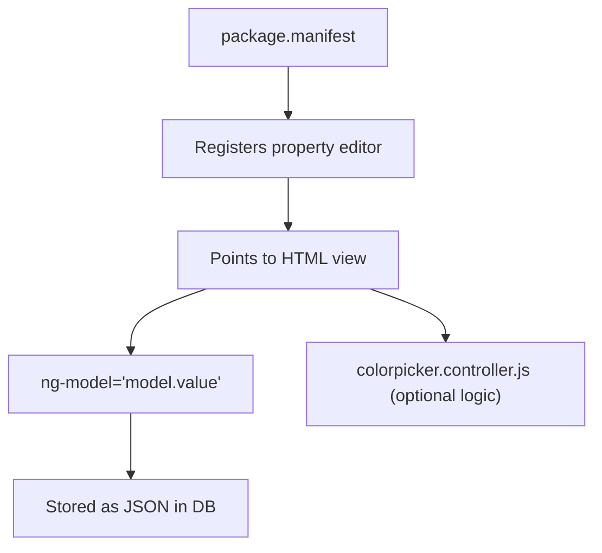

# 🧩 creating_custom_property_editors

> Build your own **custom property editor** (aka backoffice field/component) in Umbraco v13 using JavaScript (or AngularJS) + manifest config — **step-by-step**, with actual structure, paths, and reusable logic.

---

## ✅ When Do You Need a Custom Property Editor?

Umbraco ships with common field types like:

- Textstring, Richtext, Media picker, Dropdown, Tags, etc.

But you might need:

- A **color picker with brand palettes**
- A **Google Map selector**
- A **list of external API choices**
- A **custom tag input with autocomplete**
- A **custom date+time range picker**

👉 In all these cases, you build your own **App_Plugins component**.

---

## 📦 What Is a Property Editor?

It’s a **field input** that appears in the backoffice when editing content, built using:

- A `package.manifest` file
- A custom HTML/JS view
- (Optionally) a controller
- Some styling (CSS)

---

## 📁 Real Folder Structure Example

Create your editor inside:

```ini
/App_Plugins/MyColorPicker/
├── package.manifest
├── colorpicker.html
├── colorpicker.controller.js (optional)
├── colorpicker.css (optional)
```

---

## 🧾 Step-by-Step: Build a Custom Color Picker

---

### 1️⃣ Create Folder `/App_Plugins/MyColorPicker/`

This will house your editor.

---

### 2️⃣ Create `package.manifest`

```json
{
  "propertyEditors": [
    {
      "alias": "My.ColorPicker",
      "name": "My Color Picker",
      "editor": {
        "view": "~/App_Plugins/MyColorPicker/colorpicker.html",
        "valueType": "JSON"
      },
      "icon": "icon-brush",
      "group": "common"
    }
  ],
  "javascript": ["~/App_Plugins/MyColorPicker/colorpicker.controller.js"],
  "css": ["~/App_Plugins/MyColorPicker/colorpicker.css"]
}
```

> 🧠 `alias` is how Umbraco refers to the editor. `view` is the path to the custom UI.

---

### 3️⃣ Create `colorpicker.html`

```html
<div class="my-color-picker">
  <label>Select a color:</label>
  <input type="color" ng-model="model.value" />
</div>
```

If you want to handle color history or formats, you'll go fancier.

---

### 4️⃣ Create Optional Controller `colorpicker.controller.js`

```javascript
angular.module("umbraco").controller("My.ColorPickerController", function ($scope) {
  // You can watch, validate, fetch, or transform $scope.model.value here
});
```

> You can bind this controller by using:
> `ng-controller="My.ColorPickerController"` in `colorpicker.html`

---

### 5️⃣ (Optional) Add `colorpicker.css`

```css
.my-color-picker input {
  width: 100px;
  height: 30px;
  border-radius: 4px;
}
```

---

### 6️⃣ Restart Umbraco

Umbraco scans `/App_Plugins` on startup or model rebuild.

---

## 🧪 Test It

1. Go to **Settings → Data Types → Create New**
2. Choose your new **"My Color Picker"** from the list
3. Use it in a Document Type
4. Create/edit content — your custom field should now appear.

---

## 🧠 Behind the Scenes



---

## ⚠️ Things to Watch For

| Problem                 | Fix                                             |
| ----------------------- | ----------------------------------------------- |
| Editor doesn't appear   | Wrong `view` path, check console                |
| Value not saved         | Use `ng-model="model.value"` exactly            |
| Controller doesn’t fire | Match `controller` name + angular.module syntax |
| Styles not loaded       | Add in `css` array of `package.manifest`        |

---

## ✅ Summary

| File               | Purpose                          |
| ------------------ | -------------------------------- |
| `package.manifest` | Registers the editor in Umbraco  |
| `*.html`           | Your custom field UI             |
| `*.controller.js`  | Optional logic layer (AngularJS) |
| `*.css`            | Optional styling                 |

---

## 🚀 Practice Challenge

Create a custom **Google Maps Picker**:

- Input field + map popup
- Stores `{ lat, lng }`
- Use it in a `Location` Document Type
