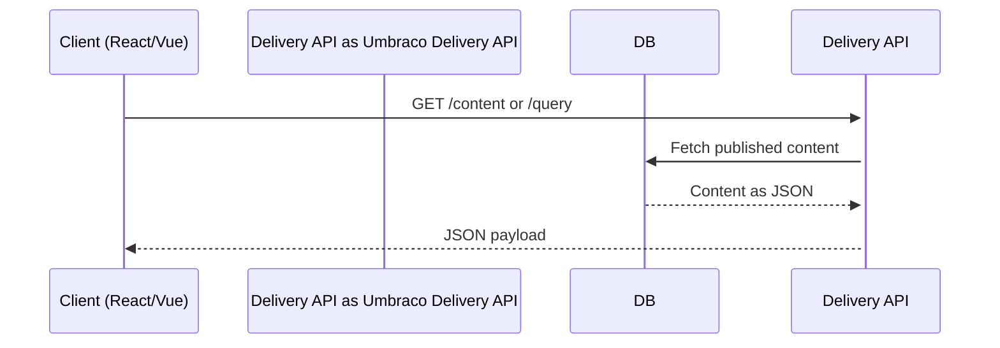
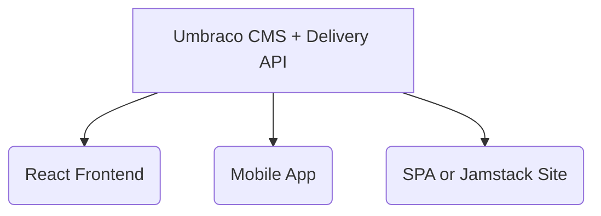

# 🌐 Headless Umbraco with Delivery API

> Learn how to **expose your Umbraco content as JSON APIs** using Umbraco’s built-in **Delivery API**, introduced in v12+ and improved in v13.

---

## 🧠 What Is the Delivery API?

The **Delivery API** is Umbraco's native **read-only JSON API layer**, used to expose your published content — no need to build custom controllers or GraphQL.

It’s perfect for:

- **Headless sites** (React, Vue, Angular, Next.js)
- **Mobile apps**
- **Jamstack static sites**

🔐 Fully respects public access, caching, language variants, and more.

---

## ✅ Prerequisites

- Umbraco v13+ installed
- Enabled `Umbraco.Cms.Web.Common.DeliveryApi` in your project

> 📦 Already included if you create a project from `.NET CLI`:

```bash
dotnet new umbraco -n MyHeadlessSite
```

---

## 🧭 URL Base Paths

| Purpose          | Endpoint                                    |
| ---------------- | ------------------------------------------- |
| Get Root Content | `GET /umbraco/delivery/api/v1/content`      |
| Get By ID (GUID) | `GET /umbraco/delivery/api/v1/content/{id}` |
| Search/Query     | `POST /umbraco/delivery/api/v1/query`       |
| Get Media        | `GET /umbraco/delivery/api/v1/media/{id}`   |
| Get Languages    | `GET /umbraco/delivery/api/v1/languages`    |

---

## 🔓 Enable the Delivery API (If Disabled)

In `appsettings.json`, ensure:

```json
"Umbraco": {
  "CMS": {
    "DeliveryApi": {
      "Enabled": true
    }
  }
}
```

---

## 📦 Step-by-Step Example: Setup & Test

Let’s say you have a `BlogPost` document type with fields:

- `title` (Textstring)
- `bodyText` (Rich Text)
- `publishDate` (Date)

---

### ✅ 1. Add Test Content

Go to the **Backoffice** → Content → Create a few blog posts under a node like `/blog`.

---

### ✅ 2. Call the API

Use Postman or your browser to hit:

```http
GET https://localhost:5001/umbraco/delivery/api/v1/content
```

You’ll get a list of published nodes with full JSON models.

---

### ✅ 3. Get A Specific Node by ID

Use the GUID (from backoffice or first API call):

```http
GET /umbraco/delivery/api/v1/content/2784f8fa-df17-4b6a-8be2-bdc9e44f5f5c
```

Sample response:

```json
{
  "id": "2784f8fa-df17-4b6a-8be2-bdc9e44f5f5c",
  "contentType": "blogPost",
  "name": "Understanding SEO in Umbraco",
  "url": "/blog/understanding-seo",
  "properties": {
    "title": "Understanding SEO in Umbraco",
    "bodyText": "<p>Use meta tags, sitemaps...</p>",
    "publishDate": "2024-05-20"
  }
}
```

---

## 🔍 Advanced: Search Content via Query API

### ✅ POST `/umbraco/delivery/api/v1/query`

```json
{
  "filter": {
    "contentType": "blogPost"
  },
  "take": 10
}
```

This returns up to 10 blog posts.

---

## 💡 How This Works (Internally)



---

## 🧰 Tips & Tricks

| Feature              | How to Use                                           |
| -------------------- | ---------------------------------------------------- |
| Multilingual support | Returns variants if you set `Accept-Language` header |
| Media access         | Use `/media/{id}` endpoint                           |
| Filtering            | Use query POST requests                              |
| Pagination           | Add `skip` and `take` to query body                  |
| Security             | Delivery API is read-only & public by default        |

---

## 🧱 Headless Architecture Example



---

## 🚀 Bonus Challenge

Build a simple React app that fetches blog posts from:

```ini
GET /umbraco/delivery/api/v1/content
```

Render the list with `title`, `publishDate`, and truncated `bodyText`.

---

## ✅ Summary

| You Learned                 | How                            |
| --------------------------- | ------------------------------ |
| Headless setup with Umbraco | Using built-in Delivery API    |
| JSON API Endpoints          | `/umbraco/delivery/api/v1/...` |
| Querying content            | POST `/query` with filters     |
| Frontend integration ready  | Use in React, Angular, Vue     |
