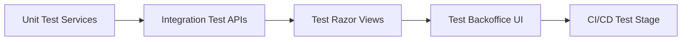

# 🧪 Testing umbraco sites

> Learn how to properly test an Umbraco v13 website — from unit tests and integration tests to full UI automation with Playwright or Selenium.

---

## 🧠 Why Testing in Umbraco Matters

Even though Umbraco is a CMS, your solution includes:

- Business logic (in Surface/API controllers)
- Content rendering (via Razor views)
- Backoffice integrations (custom editors, workflows)
- External API communication

➡️ So yes, it **needs tests** like any other .NET web project.

---

## 🧰 Types of Tests You’ll Use

| Type                | Used For                                      | Tools                              |
| ------------------- | --------------------------------------------- | ---------------------------------- |
| Unit Tests          | Testing methods, services, helpers            | xUnit / NUnit + Moq                |
| Integration Tests   | Testing endpoints, controllers, rendering     | `Microsoft.AspNetCore.Mvc.Testing` |
| Backoffice UI Tests | Testing the admin UI (App_Plugins, workflows) | Playwright / Selenium              |
| Snapshot Testing    | Comparing generated HTML content over time    | Verify                             |

---

## 🧪 1️⃣ Unit Testing with xUnit & Moq

Example: test a service that calculates SEO score based on content.

```csharp
public interface ISeoService {
    int GetScore(string title, string bodyText);
}
```

### ✅ Test

```csharp
public class SeoServiceTests {
    [Fact]
    public void GetScore_ReturnsExpectedValue() {
        var service = new SeoService();
        var score = service.GetScore("Welcome", "Short body text");
        Assert.True(score < 50);
    }
}
```

➡️ ✅ No need to mock Umbraco here — pure logic.

---

## 🔗 2️⃣ Integration Testing Razor Views or API

Umbraco exposes endpoints like `/umbraco/api/`.

To test them:

```csharp
public class BlogApiTests : IClassFixture<WebApplicationFactory<Program>> {
    private readonly HttpClient _client;

    public BlogApiTests(WebApplicationFactory<Program> factory) {
        _client = factory.CreateClient();
    }

    [Fact]
    public async Task GetBlogPosts_Returns200() {
        var response = await _client.GetAsync("/umbraco/api/blog/getall");
        Assert.Equal(HttpStatusCode.OK, response.StatusCode);
    }
}
```

> 🧠 Make sure your API controller inherits from `UmbracoApiController`.

---

## 🧪 3️⃣ Snapshot Testing Razor Output (Optional)

Tool: [Verify](https://github.com/VerifyTests/Verify)

```csharp
[UsesVerify]
public class BlogViewTests {
    [Fact]
    public async Task BlogRendersCorrectly() {
        var result = await _razorEngine.RenderAsync("/Views/Blog/Index.cshtml", model);
        await Verify(result);
    }
}
```

> This lets you “snapshot” the HTML and detect when it changes.

---

## 🎯 4️⃣ End-to-End Backoffice UI Testing

You’ve built a custom property editor?

👉 Test it in the backoffice UI using **Playwright** or **Selenium**.

### 🧪 Playwright Sample

Install Playwright:

```bash
npm i -D @playwright/test
npx playwright install
```

```ts
import { test, expect } from "@playwright/test";

test("Create content item", async ({ page }) => {
  await page.goto("https://localhost:5001/umbraco");
  await page.fill("#username", "admin");
  await page.fill("#password", "123456");
  await page.click("text=Login");

  await page.click("text=Content");
  await page.click("text=+ Create");
  await page.fill('input[name="title"]', "Test Page");
  await page.click('button:has-text("Save")');
  await expect(page.locator("text=Test Page")).toBeVisible();
});
```

> 🧠 You can automate testing of custom App_Plugins and document creation.

---

## 🔁 Test Lifecycle in Umbraco Projects



---

## 🔒 Best Practices

| Practice                       | Why                                     |
| ------------------------------ | --------------------------------------- |
| Use mocks for Umbraco APIs     | `Umbraco.Cms.Core` services are complex |
| Isolate content dependencies   | Avoid using real DB in unit tests       |
| Use factory pattern for models | Easier test setup                       |
| Snapshot test views            | Avoid regressions on content rendering  |
| CI pipeline integration        | Run all tests on each commit/push       |

---

## ✅ Summary

| You Learned                  | Tool / Concept                            |
| ---------------------------- | ----------------------------------------- |
| Unit testing business logic  | xUnit + Moq                               |
| Testing Razor and APIs       | Integration Test w/ WebApplicationFactory |
| Snapshot testing HTML output | Verify                                    |
| Backoffice UI automation     | Playwright / Selenium                     |
| CI/CD integration ready      | ✅                                        |
