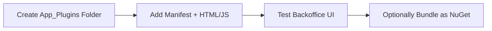

# 📦 Working with Umbraco Packages

> Learn how to **install, manage, extend, and even build your own Umbraco packages**, including NuGet packages, App_Plugins, and community add-ons like SEO tools or uSync.

---

## 🧠 What Are Umbraco Packages?

An **Umbraco package** is a reusable piece of functionality that can be:

- A content editor
- A custom dashboard
- A backoffice plugin
- A configuration or sync tool (like uSync)
- A complete website starter kit

It’s like a plugin ecosystem — **NuGet for your CMS**.

---

## 🧰 Types of Packages

| Type           | Description                                                              |
| -------------- | ------------------------------------------------------------------------ |
| NuGet packages | Most core and community packages (e.g., `Umbraco.Community.Contentment`) |
| ZIP packages   | Legacy packages with JS/HTML/Views stored under `App_Plugins/`           |
| Local dev      | Your own backoffice extensions using AngularJS or Web Components         |

---

## 🔌 Installing Community Packages (via NuGet)

Let’s say you want to install **uSync**, a popular package for syncing content types.

```bash
dotnet add package uSync.Complete
```

It installs:

- Custom dashboards
- Export/import tools
- Background sync jobs

🧠 After installing, rebuild and log into the backoffice — you’ll see a new **uSync** section.

---

## 🧱 Popular Packages to Try

| Package                         | Use Case                    |
| ------------------------------- | --------------------------- |
| `uSync.Complete`                | Sync content & config       |
| `SEOChecker`                    | SEO analysis in backoffice  |
| `Formulate`                     | Drag-and-drop form builder  |
| `Skybrud.Social`                | Social API integrations     |
| `Matryoshka`                    | Nested property UI controls |
| `Umbraco.Community.Contentment` | Custom dashboard editors    |

Find more: [https://our.umbraco.com/packages/](https://our.umbraco.com/packages/)

---

## ⚙️ Where Packages Live in Your Project

Most packages install code, views, and JS here:

```plaintext
/Views/Partials/
/App_Plugins/[PackageName]/
/wwwroot/
/Umbraco/Config/
```

You may also see new `services` or `IHostedService` in `Startup.cs` or DI configuration.

---

## 💡 Building Your Own Package (Mini Example)

Let’s say you want to build a **custom dashboard** for internal analytics.

🧱 Project layout:

```plaintext
/App_Plugins/CustomDashboard/
  ├── package.manifest
  ├── dashboard.html
  └── dashboard.controller.js
```

📄 `package.manifest`

```json
{
  "dashboards": [
    {
      "alias": "customDashboard",
      "view": "~/App_Plugins/CustomDashboard/dashboard.html",
      "sections": ["content"],
      "weight": 10
    }
  ]
}
```

📄 `dashboard.html`

```html
<h3>📊 Custom Analytics</h3>
<div ng-controller="CustomDashboardController">
  <p>Visits today: {{visits}}</p>
</div>
```

📄 `dashboard.controller.js`

```js
angular.module("umbraco").controller("CustomDashboardController", function ($scope) {
  $scope.visits = 123;
});
```

After restarting, this shows up under the **Content section** in backoffice!

---

## 🧑‍🔧 Development Workflow for Packages



> For public sharing, you can zip `/App_Plugins` or pack it as a NuGet using `.nuspec`.

---

## 🤝 Package Dev Best Practices

| Tip                               | Why it matters                           |
| --------------------------------- | ---------------------------------------- |
| Use proper `alias` and namespaces | Avoid conflicts with other packages      |
| Use AngularJS 1.x safely          | Umbraco backoffice still uses AngularJS  |
| Respect `package.manifest` paths  | Keep things modular and neat             |
| Avoid hardcoding API URLs         | Use `umbRequestHelper` or relative paths |
| Use dependency injection          | For .NET services and logic              |

---

## 💣 Common Pitfalls

| Problem                   | Fix it by...                                       |
| ------------------------- | -------------------------------------------------- |
| Dashboard not loading     | Check `package.manifest` path and JS errors        |
| Conflicting packages      | Use unique names and folders                       |
| Not loading in backoffice | Restart site and clear browser cache               |
| App_Plugins not included  | Check `.csproj` and ensure `Copy to Output` is set |

---

## 🚀 Bonus: Convert App_Plugins to NuGet

Use `.nuspec` and `dotnet pack`:

```xml
<files>
  <file src="App_Plugins\**\*" target="contentFiles\App_Plugins\" />
</files>
```

```bash
dotnet pack
dotnet nuget push -s my-local-source
```

Then reference it like any other NuGet package.

---

## ✅ Summary

| What You Learned                    | Example or Tool                         |
| ----------------------------------- | --------------------------------------- |
| What packages are                   | uSync, SEOChecker, etc.                 |
| How to install via NuGet            | `dotnet add package`                    |
| Where packages live in Umbraco      | `/App_Plugins/`, `/Views/`, `/wwwroot/` |
| How to build your own backoffice UI | With `package.manifest` and AngularJS   |
| Dev + packaging workflow            | Local dev → zip or NuGet                |
