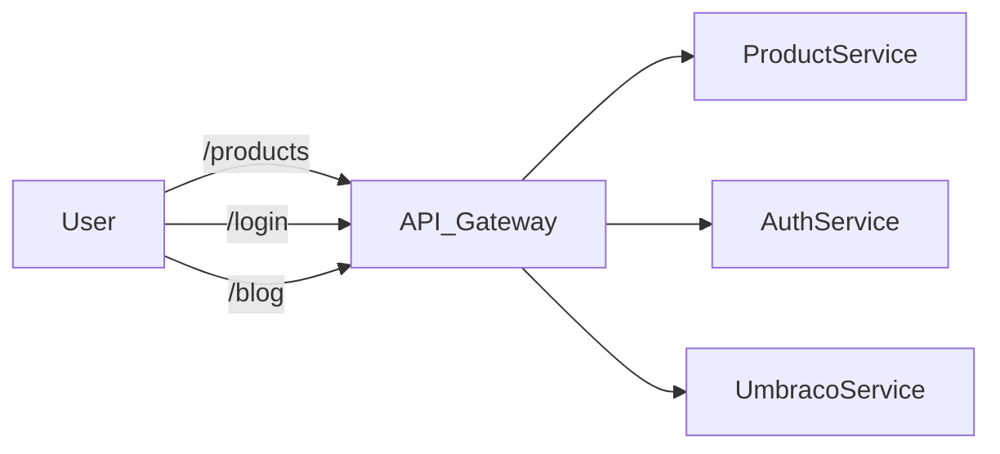

# 🧱 Umbraco_in_microservices_architecture

> **Official Definition**: Umbraco can be integrated into a microservices architecture as a dedicated service responsible for content management, either in a traditional or headless CMS role, using APIs and standardized contracts.

---

## 🧠 Why Microservices with Umbraco?

Monolithic apps are like all-in-one printers. They _do everything_... until one thing breaks. Then it all breaks. 😬

Microservices solve this by **splitting responsibilities** into small, focused services. Umbraco fits in beautifully here — as the **Content Management Service**.

---

## 🧩 Typical Microservices Use Case for Umbraco

- You have:

  - A **React frontend** served by a frontend service.
  - A **product catalog microservice** powered by .NET or Node.
  - A **user service** with authentication and profiles.
  - A **content service** — and this is where **Umbraco** shines.

---

## 🔥 When to Use Umbraco in a Microservices Setup

- You need content editing for marketing teams 🧑‍💼
- You want SEO-friendly routing built-in 🌍
- You want to manage content in one place but show it across multiple platforms (website, app, kiosk...) 📱💻🖥️

---

## 🏗️ How to Integrate Umbraco in Microservices Architecture

### 🧱 1. Use Umbraco Headless (Heartcore or Delivery API)

- **Delivery API** (v12+): Modern REST-based content delivery.
- **Heartcore** (Cloud): SaaS-based headless Umbraco.
- Both let you expose **structured content** via APIs.

> Umbraco = Content service → Get content from API → Display anywhere

---

### 💡 2. Deploy Umbraco as a Microservice (Dockerized)

```bash
# Dockerfile
FROM mcr.microsoft.com/dotnet/aspnet:8.0
COPY . /app
WORKDIR /app
ENTRYPOINT ["dotnet", "YourUmbracoProject.dll"]
```

```yaml
# docker-compose.yaml
umbraco:
  build: .
  ports:
    - "8080:80"
  depends_on:
    - sqlserver
```

Now Umbraco is its own container — easily deployable, scalable, and replaceable. 📦

---

### 🔌 3. Connect with API Gateway

Use **API Gateway** (like NGINX, Kong, or AWS API Gateway) to route traffic:



API Gateway = Traffic Cop 🚦
Each service = Own domain of responsibility 🧠

---

### 📬 4. Use Event-Driven or Message-Based Communication

Don’t call Umbraco directly for everything! Use:

- **RabbitMQ**, **Kafka**, or **EventBridge** for pub/sub
- Example: ProductService updates → triggers message → Umbraco listens and syncs content

💡 Reduces coupling. Services don’t need to know each other’s guts.

---

## 🛡️ 5. Secure the Integration

- Umbraco APIs should be protected by **API keys**, **JWTs**, or **OAuth2**
- Avoid exposing backoffice APIs — use **Delivery API** only
- Consider a **BFF (Backend-for-Frontend)** to reduce direct access

---

## 🧪 6. Health Checks, Monitoring, Observability

- Add `/healthz` endpoint to your Umbraco container
- Integrate with **Prometheus + Grafana** or **Datadog**
- Use **OpenTelemetry** for tracing between services

---

## ✅ Best Practices Checklist

| ✅ Practice                       | Description                               |
| --------------------------------- | ----------------------------------------- |
| Use Docker + Delivery API         | Containerize and expose content APIs only |
| Add caching layer                 | Use Redis for caching delivery content    |
| Don’t store business logic in CMS | Umbraco = Content only                    |
| Use CI/CD pipelines               | Automate builds and deploys               |
| Rate-limit and throttle APIs      | Protect Umbraco service from abuse        |
| Isolate DB and media storage      | Avoid shared storage across services      |

---

## 📦 Real-World Example Stack

| Layer         | Tool                         |
| ------------- | ---------------------------- |
| Frontend      | React (Next.js or Astro)     |
| API Gateway   | NGINX                        |
| CMS Service   | Umbraco 13 with Delivery API |
| Product DB    | PostgreSQL                   |
| Messaging     | RabbitMQ                     |
| Auth          | Auth0                        |
| Observability | Prometheus + Grafana         |

---

## 📚 References

- [Umbraco Delivery API](https://docs.umbraco.com/umbraco-cms/reference/delivery-api/index)
- [Umbraco Heartcore](https://umbraco.com/products/umbraco-heartcore/)
- [Microservices on Microsoft Docs](https://learn.microsoft.com/en-us/dotnet/architecture/microservices/)
- [Dockerize Umbraco](https://github.com/umbraco/Umbraco.Docs.Samples/tree/main/samples/docker)

---

## 🧠 TL;DR

> ✅ Umbraco plays perfectly in a microservices world as a **Content Service**, especially when headless. Dockerize it, expose the Delivery API, secure it, and let the rest of your ecosystem scale independently.
