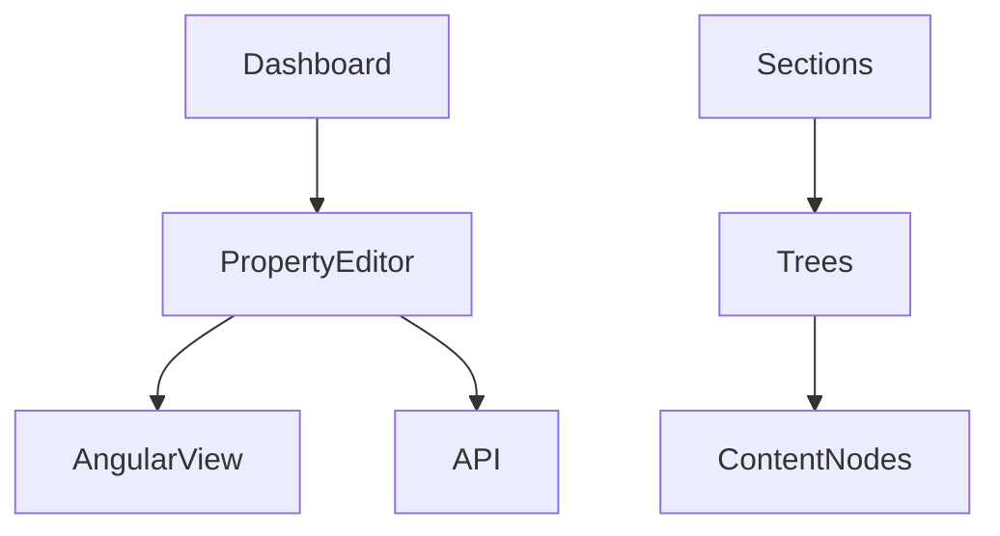

# 🛠️ `backoffice_customization.md`

> Learn how to extend, personalize, and brand the Umbraco backoffice to suit custom editorial workflows, fields, dashboards, and UI styling.

---

## 🧠 What Is the Backoffice?

The **backoffice** is Umbraco’s admin dashboard — where editors create content, manage media, control languages, and more. Think of it as the **CMS control panel**.

If you're a dev building custom websites for clients, customizing the backoffice = **customizing their day-to-day workspace**.

---

## 🧩 What Can You Customize?

| 🔧 Feature                    | 🔍 Purpose                                                 |
| ----------------------------- | ---------------------------------------------------------- |
| **Custom Dashboards**         | Add widgets or views on the landing page of the backoffice |
| **Custom Property Editors**   | Add custom fields beyond text/image/date/etc.              |
| **Sections & Trees**          | Create new main nav sections like "Products", "Analytics"  |
| **Styles & Branding**         | Add company logo, theme, or CSS tweaks                     |
| **User Permissions**          | Control what each role sees and edits                      |
| **Language & Labels**         | Translate or rewrite labels (i18n)                         |
| **Notifications & Workflows** | Add approve/publish flows or alerts                        |

---

## 🧱 Anatomy of the Backoffice



Umbraco backoffice is built with **AngularJS 1.x** (yes, still!) and .NET Core APIs.

You customize it via:

- Angular components
- JSON config
- .NET controllers

---

## 🧰 1. Add a Custom Dashboard

### 📍 Location: `/App_Plugins/YourPlugin/dashboard.html`

**Example HTML:**

```html
<div>
  <h2>Welcome, editor! 🎉</h2>
  <p>Here's your custom dashboard.</p>
</div>
```

**Add manifest: `/App_Plugins/YourPlugin/package.manifest`**

```json
{
  "dashboards": [
    {
      "alias": "customDashboard",
      "view": "/App_Plugins/YourPlugin/dashboard.html",
      "sections": ["content"],
      "weight": 10
    }
  ]
}
```

---

## 🧰 2. Create a Custom Property Editor

Let’s say you want a **Google Maps picker**.

### 📁 Folder

`/App_Plugins/MapPicker/`

### 📝 Manifest

```json
{
  "propertyEditors": [
    {
      "alias": "MapPicker",
      "name": "Google Maps Picker",
      "editor": {
        "view": "~/App_Plugins/MapPicker/view.html",
        "valueType": "JSON"
      }
    }
  ]
}
```

### 🖼️ View

```html
<input type="text" ng-model="model.value.latlng" placeholder="Lat,Lng" />
```

### 💡 Use it in a Document Type after building it

---

## 🧰 3. Add a New Section

```csharp
[Section("products", "Products", "/App_Plugins/Products/icon.png")]
public class ProductsSection : ISection {}
```

Then define a tree and a controller to load items.

Useful when you’re building apps inside Umbraco (e.g., Product Catalog, CRM).

---

## 🎨 4. Style the Backoffice

Override CSS with:

```html
<link rel="stylesheet" href="/App_Plugins/MyPlugin/custom.css" />
```

Or override themes, logos, icons using:

- `backoffice/favicon.ico`
- Custom dashboard logos
- Your own SVG icons

---

## 👥 5. Customize Roles & Permissions

Go to:
📍 **Users → Groups → Set Permissions**

Granular options like:

| Action            | Can Restrict? |
| ----------------- | ------------- |
| Create/edit pages | ✅ Yes        |
| Access media      | ✅ Yes        |
| Publish content   | ✅ Yes        |
| See document type | ✅ Yes        |

---

## 🌍 6. Translate Labels (Localization)

Use:
📁 `/umbraco/config/lang/en.xml`
Or create your own custom lang file for plugins.

You can override phrases like:

```xml
<area alias="content">
  <key alias="create">Create New 🤖</key>
</area>
```

---

## 🔔 7. Add Notifications or Workflow

Via custom C# handlers or workflow engines like [Plumber](https://our.umbraco.com/packages/backoffice-extensions/plumber/).

Examples:

- Email admin on content publish
- Require approval before publishing
- Log content edits

---

## 🧪 Best Practices

| ✅ Practice                           | 💬 Why It Matters              |
| ------------------------------------- | ------------------------------ |
| Use consistent naming for plugins     | Easier to debug & deploy       |
| Keep custom JS/CSS in `/App_Plugins`  | Avoid collision with core      |
| Localize all labels                   | Support multilingual editors   |
| Add fallbacks                         | Prevent breaking UX            |
| Use version control for backoffice UI | Don't edit production manually |

---

## 🔗 References

- [Umbraco Docs – Dashboards](https://docs.umbraco.com/umbraco-cms/extending/dashboards/)
- [Custom Property Editors](https://docs.umbraco.com/umbraco-cms/extending/property-editors/)
- [Backoffice Sections](https://docs.umbraco.com/umbraco-cms/extending/sections/)
- [User Permissions](https://docs.umbraco.com/umbraco-cms/fundamentals/users/permissions)

---

## 🧠 TL;DR

> Customizing the **backoffice** is like giving editors their own cockpit. Dashboards, fields, trees, and permissions can all be tailored to match the team’s workflow — and it’s done with AngularJS + .NET + JSON + Razor views.
